# Architecture Diagrams

Mermaid-based architectural diagrams for the Discord Bot application.

---

## 1. System Context (C4 Level 1)

High-level view of the system and its external dependencies.

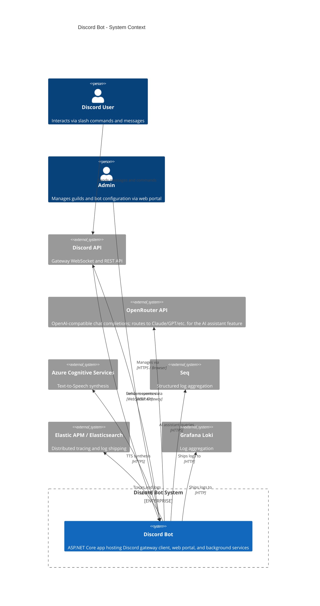

---

## 2. Container Diagram (C4 Level 2)

Internal containers and layers within the system.

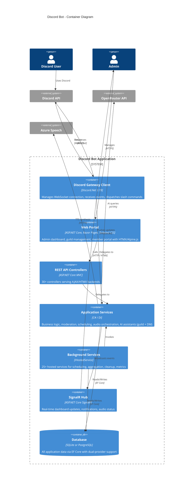

---

## 3. Clean Architecture Layers

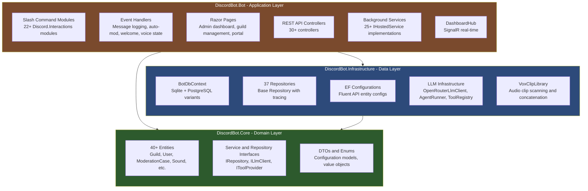

---

## 4. Feature Domain Map

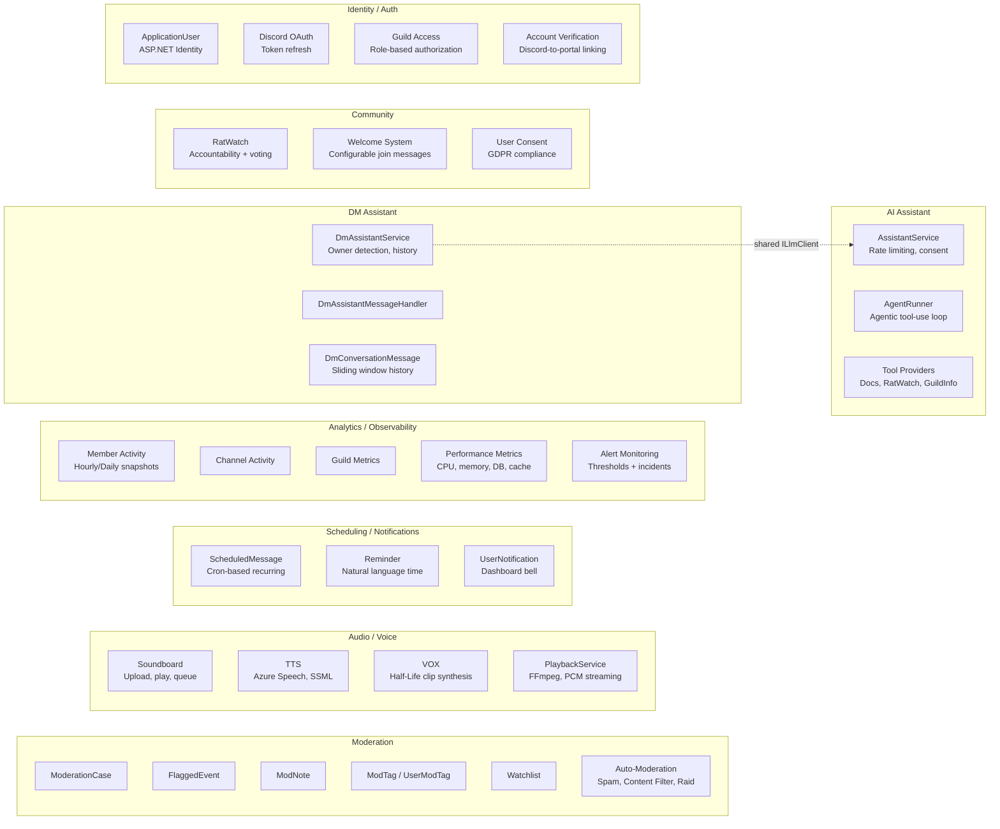

---

## 5. Audio Pipeline

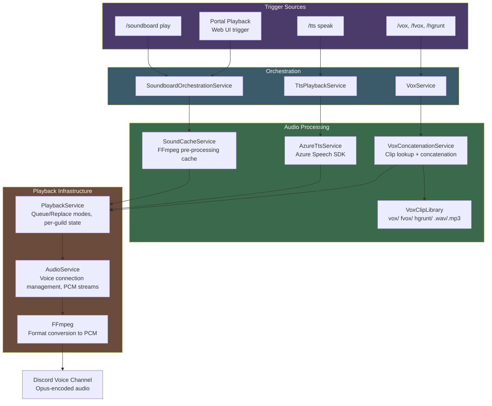

---

## 6. AI Assistant Sequence

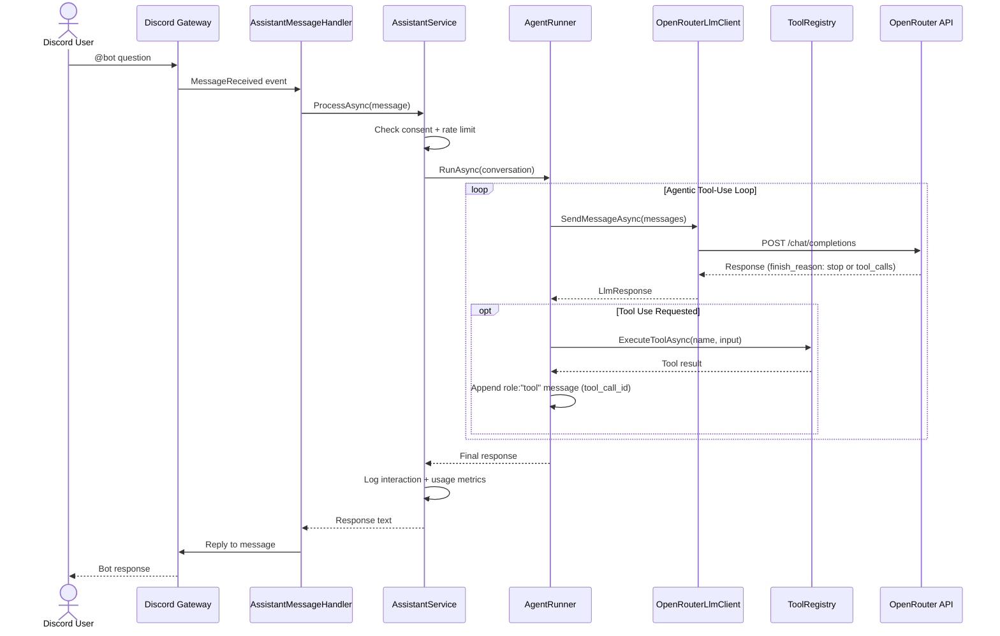

---

## 6b. DM Assistant Sequence

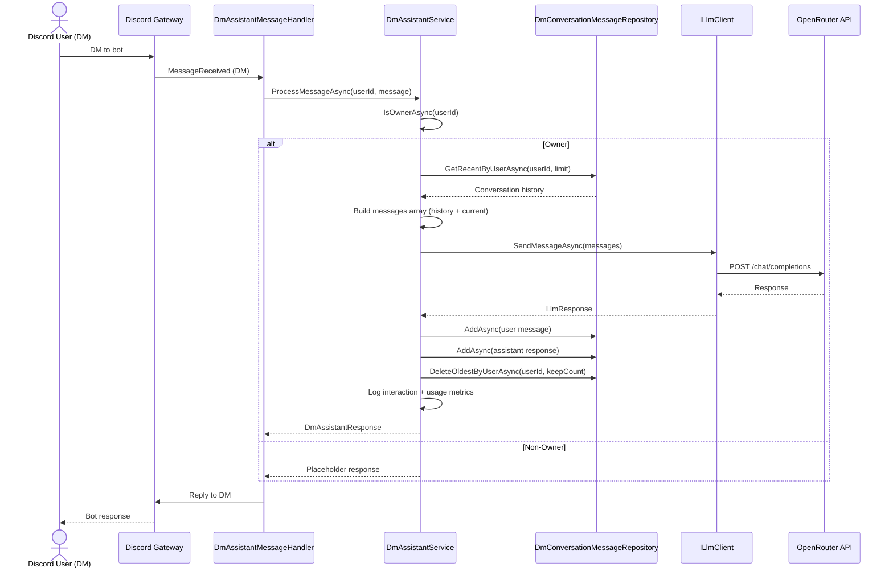

---

## 7. Request Pipeline (Web Portal)

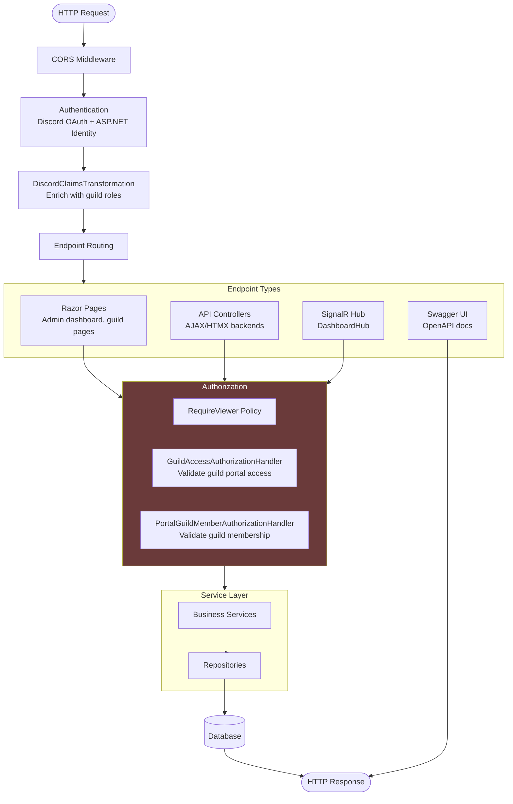

---

## 8. Background Services Architecture

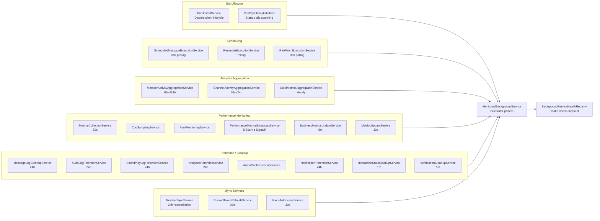

---

## 9. Core Entity Relationships

```mermaid
erDiagram
    Guild ||--o{ GuildMember : "has members"
    User ||--o{ GuildMember : "belongs to guilds"
    Guild ||--o| GuildModerationConfig : "has config"
    Guild ||--o| GuildAudioSettings : "has audio config"
    Guild ||--o| GuildTtsSettings : "has TTS config"
    Guild ||--o| GuildRatWatchSettings : "has RatWatch config"
    Guild ||--o| AssistantGuildSettings : "has AI config"
    Guild ||--o| WelcomeConfiguration : "has welcome config"

    Guild ||--o{ ModerationCase : "contains"
    Guild ||--o{ FlaggedEvent : "contains"
    ModerationCase }o--o| FlaggedEvent : "relates to"
    Guild ||--o{ ModNote : "contains"
    Guild ||--o{ ModTag : "defines"
    ModTag ||--o{ UserModTag : "applied as"
    Guild ||--o{ Watchlist : "monitors"

    Guild ||--o{ Sound : "owns"
    Sound ||--o{ SoundPlayLog : "tracks plays"
    Guild ||--o{ TtsMessage : "logs TTS"

    Guild ||--o{ RatWatch : "hosts"
    RatWatch ||--o{ RatVote : "receives votes"
    RatWatch ||--o| RatRecord : "produces record"

    Guild ||--o{ ScheduledMessage : "schedules"
    Guild ||--o{ Reminder : "has reminders"

    Guild ||--o{ CommandLog : "logs commands"
    Guild ||--o{ MessageLog : "logs messages"
    User ||--o{ CommandLog : "executes"
    User ||--o{ MessageLog : "authors"

    Guild ||--o{ MemberActivitySnapshot : "aggregates"
    Guild ||--o{ ChannelActivitySnapshot : "aggregates"
    Guild ||--o{ GuildMetricsSnapshot : "snapshots"

    Guild ||--o{ AssistantInteractionLog : "logs AI"
    Guild ||--o{ AssistantUsageMetrics : "tracks AI cost"

    User ||--o{ DmConversationMessage : "has DM history"
    User ||--o{ DmAssistantInteractionLog : "logs DM interactions"
    User ||--o{ DmAssistantUsageMetrics : "tracks DM usage"

    ApplicationUser ||--o| DiscordOAuthToken : "authenticates with"
    ApplicationUser ||--o{ UserGuildAccess : "has portal access"
    ApplicationUser ||--o{ VerificationCode : "verifies via"
    ApplicationUser ||--o{ UserNotification : "receives"
```

---

## 10. Observability Stack

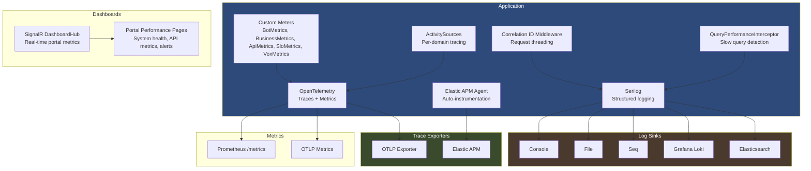

---

## 11. Auto-Moderation Flow

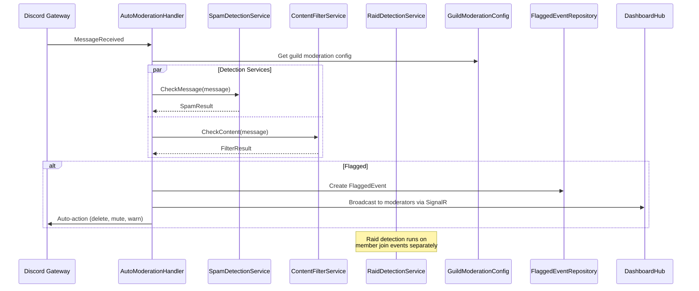

---

## 12. Authentication and Identity

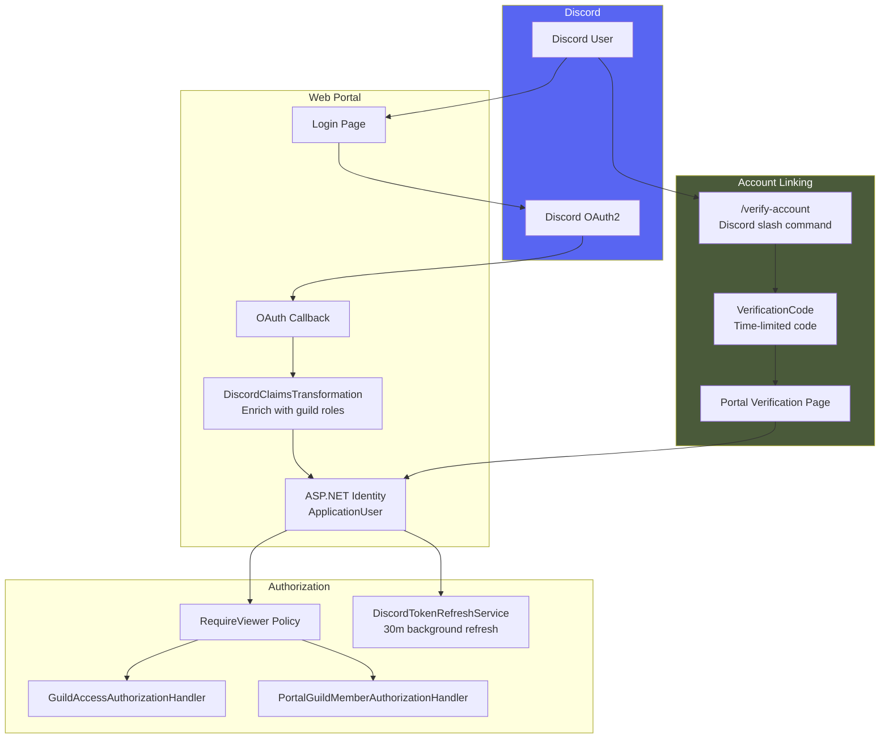
