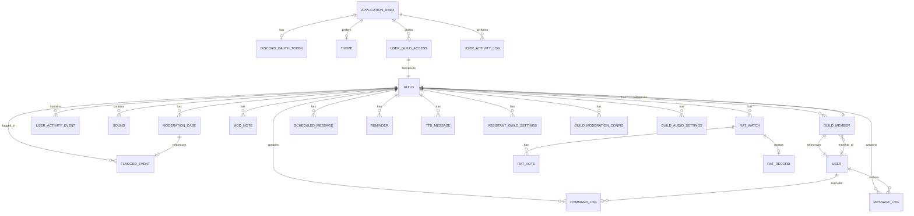

# Data Model Architecture

Quick reference guide for understanding the Discord bot's data model without reading all entity files. This document is designed for AI agents (Claude) to quickly reference the system's structure.

**See [database-schema.md](../articles/database-schema.md) for detailed entity definitions, column specifications, and comprehensive schema documentation.**

## Entity Relationship Diagram (ERD)



## Core Entity Groups

### 1. Discord Identity (Guild, User, GuildMember)

| Entity | Purpose | Key Fields | Relationships |
|--------|---------|-----------|-----------------|
| **Guild** | Represents a Discord server registered with the bot | `Id` (ulong, PK), `Name`, `JoinedAt`, `IsActive`, `LeftAt`, `Prefix` | Owns all guild-scoped data |
| **User** | Represents a Discord user known to the bot | `Id` (ulong, PK), `Username`, `Discriminator`, `FirstSeenAt`, `LastSeenAt`, `AccountCreatedAt`, `AvatarHash`, `GlobalDisplayName` | One-to-many with logs, guild memberships |
| **GuildMember** | Join table with membership metadata | `GuildId`, `UserId` (composite PK), `JoinedAt`, `Nickname`, `CachedRolesJson`, `LastActiveAt`, `LastCachedAt`, `IsActive` | Links User → Guild with caching |

**Notes:**
- Discord IDs are `ulong` (64-bit). When serialized to JSON/JavaScript, must be treated as strings to preserve precision.
- `GuildMember.IsActive = false` is a soft-delete indicating the user has left the guild.

### 2. Audit & Logging (CommandLog, MessageLog, AuditLog)

| Entity | Purpose | Key Fields | Relationships |
|--------|---------|-----------|-----------------|
| **CommandLog** | Audit trail for Discord slash command executions | `Id` (Guid, PK), `GuildId` (nullable), `UserId`, `CommandName`, `Parameters` (JSON), `ExecutedAt`, `ResponseTimeMs`, `Success`, `ErrorMessage`, `CorrelationId` | References Guild, User |
| **MessageLog** | Audit trail for Discord messages for analytics/moderation | `Id` (long, PK), `DiscordMessageId` (ulong), `AuthorId`, `ChannelId`, `ChannelName`, `GuildId` (nullable), `Source` (enum), `Content`, `Timestamp`, `LoggedAt`, `HasAttachments`, `HasEmbeds`, `ReplyToMessageId` (nullable) | References Guild, User |
| **AuditLog** | System-wide audit entries for security/compliance | `Id` (long, PK), `Timestamp`, `Category` (enum), `Action` (enum), `ActorId`, `ActorType` (enum), `TargetType`, `TargetId`, `GuildId` (nullable), `Details` (JSON), `IpAddress`, `CorrelationId` | Standalone (references via IDs, not FK) |

**Notes:**
- `CommandLog` and `MessageLog` use long IDs to support high-volume logging.
- `MessageLog.Source` indicates whether message is from DM or ServerChannel.
- `AuditLog` uses JSON `Details` field for action-specific context (flexible schema).
- Correlation IDs group related entries across these three tables.

### 3. Application Authentication (ApplicationUser, DiscordOAuthToken)

| Entity | Purpose | Key Fields | Relationships |
|--------|---------|-----------|-----------------|
| **ApplicationUser** | ASP.NET Core Identity user with Discord integration | `Id` (string, PK), `DiscordUserId` (ulong?, unique), `DiscordUsername`, `DiscordAvatarUrl`, `DisplayName`, `IsActive`, `CreatedAt`, `LastLoginAt`, `PreferredThemeId` (FK) | Has OAuth token (1:1), has Theme preference |
| **DiscordOAuthToken** | OAuth2 refresh tokens for Discord API access | `ApplicationUserId` (PK), `AccessToken`, `RefreshToken`, `ExpiresAt`, `CreatedAt`, `UpdatedAt` | Belongs to ApplicationUser |

**Notes:**
- ApplicationUser extends IdentityUser (built-in identity tables: AspNetUsers, AspNetRoles, etc.).
- DiscordUserId is nullable; users can log in via email without linking Discord.
- OAuth tokens are auto-refreshed; `ExpiresAt` is used for refresh logic.

### 4. Guild Configuration (GuildModerationConfig, GuildAudioSettings, AssistantGuildSettings)

| Entity | Purpose | Key Fields | Relationships |
|--------|---------|-----------|-----------------|
| **GuildModerationConfig** | Auto-moderation rule configuration per guild | `GuildId` (ulong, PK), `Mode` (enum: Simple/Advanced), `SimplePreset` (nullable), `SpamConfig` (JSON), `ContentFilterConfig` (JSON), `RaidProtectionConfig` (JSON), `UpdatedAt` | Belongs to Guild |
| **GuildAudioSettings** | Soundboard feature configuration per guild | `GuildId` (ulong, PK), `AudioEnabled`, `AutoLeaveTimeoutMinutes`, `QueueEnabled`, `MaxDurationSeconds`, `MaxFileSizeBytes`, `MaxSoundsPerGuild`, `MaxStorageBytes`, `EnableMemberPortal`, `SilentPlayback`, `CreatedAt`, `UpdatedAt` | Belongs to Guild, has CommandRoleRestrictions |
| **AssistantGuildSettings** | AI assistant feature configuration per guild | `GuildId` (ulong, PK), `IsEnabled`, `AllowedChannelIds` (JSON array), `RateLimitOverride` (nullable), `CreatedAt`, `UpdatedAt` | Belongs to Guild |

**Notes:**
- Configuration entities use Guild ID as primary key (one config per guild).
- JSON fields hold nested configuration objects; parsed into domain models when loaded.
- `GuildAudioSettings.CommandRoleRestrictions` is a collection (1:many relationship).

### 5. Moderation (ModerationCase, ModNote, FlaggedEvent)

| Entity | Purpose | Key Fields | Relationships |
|--------|---------|-----------|-----------------|
| **ModerationCase** | Formal moderation action (warn, kick, ban, mute, note) | `Id` (Guid, PK), `CaseNumber` (long, scoped to guild), `GuildId`, `TargetUserId`, `ModeratorUserId`, `Type` (enum), `Reason`, `Duration` (nullable), `CreatedAt`, `ExpiresAt` (nullable), `RelatedFlaggedEventId`, `ContextMessageId`, `ContextChannelId`, `ContextMessageContent` | References Guild, FlaggedEvent (nullable) |
| **ModNote** | Private mod-to-mod note about a user | `Id` (Guid, PK), `GuildId`, `TargetUserId`, `AuthorUserId`, `Content`, `CreatedAt` | References Guild |
| **FlaggedEvent** | Auto-detected event flagged for mod review | `Id` (Guid, PK), `GuildId`, `UserId`, `ChannelId` (nullable), `RuleType` (enum), `Severity` (enum), `Description`, `Evidence` (JSON), `Status` (enum), `ActionTaken`, `ReviewedByUserId`, `CreatedAt`, `ReviewedAt` | References Guild |

**Notes:**
- `ModerationCase.CaseNumber` is auto-incremented per guild (not globally unique).
- `ModerationCase.Duration` + `CreatedAt` = expiration logic for temporary actions.
- `FlaggedEvent.Evidence` is JSON array of message IDs, content snippets, timestamps.
- `FlaggedEvent → ModerationCase` link is optional; mod can create case independently.

### 6. Community Features (RatWatch, RatVote, RatRecord)

| Entity | Purpose | Key Fields | Relationships |
|--------|---------|-----------|-----------------|
| **RatWatch** | Accountability tracker for user commitments ("rat check") | `Id` (Guid, PK), `GuildId`, `ChannelId`, `AccusedUserId`, `InitiatorUserId`, `OriginalMessageId`, `CustomMessage`, `ScheduledAt`, `CreatedAt`, `Status` (enum), `NotificationMessageId`, `VotingMessageId`, `ClearedAt`, `VotingStartedAt`, `VotingEndedAt` | Owns RatVote collection, owns RatRecord |
| **RatVote** | User vote in a rat watch (guilty/innocent) | `Id` (Guid, PK), `RatWatchId`, `VoterUserId`, `Vote` (enum), `CastAt` | Belongs to RatWatch |
| **RatRecord** | Guilty verdict record created after failed rat check | `Id` (Guid, PK), `RatWatchId`, `AccusedUserId`, `GuildId`, `GuiltCount`, `CreatedAt` | Belongs to RatWatch |

**Notes:**
- `RatWatch.Status` tracks lifecycle: Pending → Notified → Voting → Cleared/Guilty
- `RatWatch.ClearedAt` = accused proved they were online in time.
- `RatRecord` only created if voting ends with "guilty" verdict.

### 7. Messaging & Scheduling (ScheduledMessage, Reminder, TtsMessage)

| Entity | Purpose | Key Fields | Relationships |
|--------|---------|-----------|-----------------|
| **ScheduledMessage** | Recurring message sent to a channel on schedule | `Id` (Guid, PK), `GuildId`, `ChannelId`, `Title`, `Content`, `CronExpression` (nullable), `Frequency` (enum), `IsEnabled`, `LastExecutedAt`, `NextExecutionAt`, `CreatedAt`, `CreatedBy`, `UpdatedAt` | References Guild |
| **Reminder** | User reminder delivered at specified time | `Id` (Guid, PK), `GuildId`, `ChannelId`, `UserId`, `Message`, `TriggerAt`, `CreatedAt`, `DeliveredAt`, `Status` (enum), `DeliveryAttempts`, `LastError` | References Guild |
| **TtsMessage** | Text-to-Speech message played in voice channel (audit trail) | `Id` (Guid, PK), `GuildId`, `UserId`, `Username`, `Message`, `Voice`, `DurationSeconds`, `CreatedAt` | References Guild |

**Notes:**
- `ScheduledMessage.CronExpression` used only when `Frequency = Custom`; null otherwise.
- `Reminder.Status` tracks: Pending → Delivered / Failed
- `Reminder.DeliveryAttempts` incremented on each retry; `LastError` stores failure reason.

### 8. Audio Features (Sound, SoundPlayLog, GuildTtsSettings)

| Entity | Purpose | Key Fields | Relationships |
|--------|---------|-----------|-----------------|
| **Sound** | Audio file in soundboard | `Id` (Guid, PK), `GuildId`, `Name`, `FileName`, `FileSizeBytes`, `DurationSeconds`, `UploadedById` (nullable), `UploadedAt`, `PlayCount` | References Guild |
| **SoundPlayLog** | Audit trail for sound playback | `Id` (Guid, PK), `GuildId`, `UserId`, `SoundName`, `DurationSeconds`, `PlayedAt` | References Guild |
| **GuildTtsSettings** | Text-to-Speech feature configuration | `GuildId` (ulong, PK), `TtsEnabled`, `AllowedChannelIds` (JSON), `MaxMessageLength`, `MaxMessageWordsPerMinute`, `CreatedAt`, `UpdatedAt` | References Guild |

**Notes:**
- `Sound.UploadedById` is nullable; sounds discovered from filesystem have no uploader.
- `Sound.PlayCount` is incremented each time the sound is played (performance counter).
- File storage is filesystem-based; database stores metadata only.

### 9. Analytics & Metrics (Snapshots, PerformanceIncident)

| Entity | Purpose | Key Fields | Relationships |
|--------|---------|-----------|-----------------|
| **GuildMetricsSnapshot** | Point-in-time guild activity metrics | `Id` (Guid, PK), `GuildId`, `Timestamp`, `MemberCount`, `MessageCount`, `CommandCount` | References Guild |
| **MemberActivitySnapshot** | Point-in-time member activity | `Id` (Guid, PK), `GuildId`, `UserId`, `Timestamp`, `MessageCount`, `CommandCount` | References Guild |
| **ChannelActivitySnapshot** | Point-in-time channel activity | `Id` (Guid, PK), `GuildId`, `ChannelId`, `Timestamp`, `MessageCount` | References Guild |
| **MetricSnapshot** | System-wide metrics | `Id` (Guid, PK), `Timestamp`, `OnlineGuildCount`, `TotalUserCount` | Standalone |
| **PerformanceIncident** | Performance/health issue alert | `Id` (Guid, PK), `IncidentType` (enum), `Severity` (enum), `Description`, `AffectedResource`, `StartTime`, `EndTime`, `Status` (enum) | Standalone |

**Notes:**
- Snapshots are immutable records created periodically (hourly/daily) for analytics.
- `PerformanceIncident` used for alerting on degraded performance; linked to PerformanceAlertConfig.

### 10. Web Admin (ApplicationUser Access Control)

| Entity | Purpose | Key Fields | Relationships |
|--------|---------|-----------|-----------------|
| **UserGuildAccess** | Admin portal guild access control | `ApplicationUserId` (FK), `GuildId` (ulong, FK), composite PK, `AccessLevel` (enum), `GrantedAt` | References ApplicationUser, Guild |
| **UserActivityLog** | Admin portal user activity audit trail | `Id` (Guid, PK), `ActorUserId` (FK), `TargetUserId` (FK, nullable), `Action` (enum), `Timestamp`, `IpAddress` | References ApplicationUser (both) |

**Notes:**
- `AccessLevel` enum: SuperAdmin, Admin, Moderator, Viewer (hierarchical).
- `UserActivityLog.TargetUserId` nullable for actions not scoped to a user (e.g., system actions).
- `IpAddress` captured from HTTP request for audit trail.

### 11. UI Themes & Tags

| Entity | Purpose | Key Fields | Relationships |
|--------|---------|-----------|-----------------|
| **Theme** | UI theme definition (colors, tokens) | `Id` (int, PK), `Name`, `DisplayName`, `IsDarkMode`, `CssVariables` (JSON), `IsDefault`, `CreatedAt`, `UpdatedAt` | Referenced by ApplicationUser |
| **ModTag** | Reusable tag for quick mod actions | `Id` (Guid, PK), `GuildId`, `TagName`, `Color`, `Description` | Owns UserModTag collection |
| **UserModTag** | Tags applied to a user | `Id` (Guid, PK), `GuildId`, `UserId`, `ModTagId` (FK), `AppliedByUserId`, `CreatedAt` | References ModTag |

**Notes:**
- `Theme.CssVariables` is JSON object mapping variable names to color/size values.
- `ModTag` and `UserModTag` enable quick labeling/filtering of users in moderation.

## Cascading Behavior & Constraints

### Guild Deletion
When a Guild is deleted, the following cascade:
- CommandLogs (by GuildId)
- MessageLogs (by GuildId)
- Sounds (by GuildId)
- ModerationCases (by GuildId)
- ModNotes (by GuildId)
- RatWatches (by GuildId)
- ScheduledMessages (by GuildId)
- Reminders (by GuildId)
- TtsMessages (by GuildId)
- AuditLogs (by GuildId) - soft reference via IpAddress/Details
- All configuration tables (GuildModerationConfig, GuildAudioSettings, AssistantGuildSettings, GuildTtsSettings)
- FlaggedEvents (by GuildId)
- GuildMembers (by GuildId)

**Note:** UserGuildAccess cascades are RESTRICT, so guild cannot be deleted if admin access is still granted. Manual cleanup required.

### User Deletion
When a User is deleted:
- CommandLogs (by UserId) - hard delete or soft via user ID nullification
- MessageLogs (by AuthorId) - hard delete or soft via author ID nullification
- GuildMembers (by UserId) - hard delete (member leaves)

**Note:** Discord users are rarely deleted; typically marked inactive instead.

### ApplicationUser Deletion
When an ApplicationUser is deleted:
- DiscordOAuthToken cascades (delete)
- UserGuildAccess cascades (delete)
- UserActivityLog (TargetUserId set to NULL, ActorUserId RESTRICT)

## Key Design Patterns

### Discord ID Storage
- Discord IDs are `ulong` in C# (64-bit unsigned integers).
- Stored as `long` in SQLite (with conversion in DbContext).
- Always treat as strings in JavaScript/JSON to preserve precision.

### JSON Configuration Fields
Guild configurations use JSON for flexible schema:
```json
{
  "SpamConfig": {"threshold": 5, "timeWindowMs": 5000},
  "ContentFilterConfig": {"enableProfanity": true, "enableURLs": false},
  "AllowedChannelIds": [123456789, 987654321]
}
```
Parsed into domain models when loaded; serialized back on save.

### Soft Deletes
Some entities use `IsActive` boolean instead of hard deletion:
- `Guild.IsActive` - guild marked as left
- `GuildMember.IsActive` - member soft-deleted when they leave
- `ApplicationUser.IsActive` - user disabled but data retained

Hard deletes are used for logs and events (immutable audit trails).

### Correlation & Tracing
Three tables support correlation IDs for distributed tracing:
- `CommandLog.CorrelationId`
- `AuditLog.CorrelationId`
- HTTP request correlation via Serilog middleware

## Indexes for Performance

**High-volume tables have indexes on:**
- `MessageLog`: `Timestamp`, `GuildId`, `AuthorId`, `Source`
- `CommandLog`: `ExecutedAt`, `GuildId`, `UserId`, `Success`
- `AuditLog`: `Timestamp`, `GuildId`, `Category`, `Action`
- `RatWatch`: `ScheduledAt`, `Status`, `GuildId`
- `ModerationCase`: `GuildId`, `TargetUserId`, `CreatedAt`

**Identity tables have indexes on:**
- `ApplicationUser`: `DiscordUserId` (unique), `Email` (unique), `IsActive`
- `UserGuildAccess`: `GuildId` (for guild lookups)

## Related Documentation

- **[database-schema.md](../articles/database-schema.md)** - Detailed column specifications, constraints, default values, and full schema documentation
- **[CLAUDE-REFERENCE.md](../../CLAUDE-REFERENCE.md)** - Lookup tables for configuration options, API routes, command modules

