# Service Catalog

Quick reference catalog of all services in the Discord bot system. Organized by domain area for easy discovery and understanding of service relationships.

**Last Updated**: February 2026
**Codebase Version**: v0.18.3

---

## Table of Contents

- [Audio & Voice Services](#audio--voice-services)
- [Soundboard & Audio Playback](#soundboard--audio-playback)
- [VOX System](#vox-system)
- [Text-to-Speech Services](#text-to-speech-services)
- [Discord Integration Services](#discord-integration-services)
- [User & Guild Management](#user--guild-management)
- [Moderation & Enforcement](#moderation--enforcement)
- [Rat Watch System](#rat-watch-system)
- [Analytics & Metrics](#analytics--metrics)
- [Performance Monitoring](#performance-monitoring)
- [Background Services](#background-services)
- [Notification & Alerting](#notification--alerting)
- [Data & Repository Services](#data--repository-services)
- [AI Assistant & Tools](#ai-assistant--tools)
- [Configuration & Settings](#configuration--settings)
- [Utility & Support](#utility--support)

---

## Audio & Voice Services

Services handling voice channel connection, audio streaming, and voice state management.

| Service | Location | Purpose |
|---------|----------|---------|
| `IAudioService` | Core Interfaces | Voice channel connection and disconnection management with per-guild locking |
| `AudioService` | Bot/Services | Manages Discord audio connections, maintains thread-safe state using semaphore locks |
| `IAudioNotifier` | Core Interfaces | Broadcasts audio state changes via SignalR to connected dashboards |
| `AudioNotifier` | Bot/Services | SignalR hub adapter for audio event notifications |
| `VoiceAutoLeaveService` | Bot/Services | Background service that auto-disconnects bot from voice channels after inactivity |

---

## Soundboard & Audio Playback

Services for managing sound effects, playback queuing, and audio file caching.

| Service | Location | Purpose |
|----------|----------|---------|
| `ISoundService` | Core Interfaces | High-level sound management (CRUD operations, metadata) |
| `SoundService` | Bot/Services | Implements sound entity management and Discord snowflake conversion |
| `IPlaybackService` | Bot Interfaces | Sound playback orchestration with queue/replace modes |
| `PlaybackService` | Bot/Services | FFmpeg-based playback using per-guild concurrent state and locks |
| `ISoundCacheService` | Core Interfaces | Caches processed audio blobs to reduce FFmpeg reprocessing |
| `SoundCacheService` | Bot/Services | Memory-based audio cache with file I/O fallback and LRU eviction |
| `ISoundFileService` | Core Interfaces | File system operations (upload, retrieval, validation) |
| `SoundFileService` | Bot/Services | Physical sound file handling with size validation |
| `SoundPlayLogRetentionService` | Bot/Services | Background service purging old play log records |
| `SoundboardOrchestrationService` | Bot/Services | High-level soundboard command coordination |
| `ISoundboardOrchestrationService` | Core Interfaces | Orchestrates soundboard feature workflows |

---

## VOX System

Half-Life style concatenated clip announcements (VOX, FVOX, HGRUNT).

| Service | Location | Purpose |
|---------|----------|---------|
| `IVoxService` | Core Interfaces | High-level VOX playback orchestration |
| `VoxService` | Bot/Services | Coordinates tokenization → clip lookup → concatenation → playback |
| `IVoxClipLibrary` | Core Interfaces | Inventory of available VOX clips, scanned at startup |
| `VoxClipLibraryInitializer` | Bot/Services | Initializes clip library by scanning VOX directory |
| `IVoxConcatenationService` | Core Interfaces | FFmpeg-based audio concatenation with configurable silence gaps |

---

## Text-to-Speech Services

Services for Azure Cognitive Services TTS and SSML generation.

| Service | Location | Purpose |
|---------|----------|---------|
| `ITtsService` | Core Interfaces | Text-to-speech conversion using Azure Cognitive Services |
| `AzureTtsService` | Bot/Services | Azure TTS implementation with caching and error handling |
| `ITtsSettingsService` | Core Interfaces | Guild-level TTS configuration (voices, styles, rates) |
| `ITtsHistoryService` | Core Interfaces | Tracks TTS message playback history |
| `ISsmlBuilder` | Core Interfaces | SSML markup generation for advanced TTS features |
| `ISsmlValidator` | Core Interfaces | SSML markup validation |

---

## Discord Integration Services

Services for Discord client operations, authentication, and token management.

| Service | Location | Purpose |
|---------|----------|---------|
| `IBotService` | Core Interfaces | High-level bot operations (status updates, shutdown) |
| `BotService` | Bot/Services | Bot control plane operations |
| `IBotStatusService` | Core Interfaces | Manages bot presence/status with priority-based sources |
| `BotStatusService` | Bot/Services | Tracks bot status from multiple sources (Voice, RatWatch, etc.) |
| `IDiscordTokenService` | Core Interfaces | OAuth token validation and refresh |
| `DiscordTokenService` | Bot/Services | Discord OAuth2 token handling |
| `DiscordTokenRefreshService` | Bot/Services | Background service for periodic OAuth token refresh |
| `IDiscordUserInfoService` | Core Interfaces | Fetch Discord user metadata (avatar, status, etc.) |
| `DiscordUserInfoService` | Bot/Services | Retrieves user info from Discord API with caching |
| `DiscordClientMemoryReporter` | Bot/Services | Reports Discord client memory usage to diagnostics |
| `DiscordMessageAdapter` | Bot/Services | Adapts Discord.Net IMessage to internal IDiscordMessage interface |

---

## User & Guild Management

Services for user lifecycle, guild membership, and user data operations.

| Service | Location | Purpose |
|---------|----------|---------|
| `IUserManagementService` | Core Interfaces | User creation, updates, and deletion (999 lines) |
| `UserManagementService` | Bot/Services | Full user lifecycle management with audit logging |
| `IGuildMembershipService` | Core Interfaces | Guild membership tracking and sync |
| `IGuildMemberService` | Core Interfaces | Individual member details and operations |
| `IUserDiscordGuildService` | Core Interfaces | Cross-mapping of user/guild relationships |
| `UserDiscordGuildService` | Bot/Services | Manages user presence across multiple Discord guilds |
| `IGuildService` | Core Interfaces | Guild-level operations and metadata |
| `MemberSyncService` | Bot/Services | Background service: full guild member sync on startup + daily reconciliation |
| `MemberSyncQueue` | Bot/Services | Queues pending member sync operations |
| `MemberEventHandler` | (Handler) | Reacts to member join/leave/update events |
| `IUserPurgeService` | Core Interfaces | Bulk user deletion and data cleanup |
| `UserPurgeService` | Bot/Services | GDPR-compliant user data deletion |
| `BulkPurgeService` | Bot/Services | Coordinates bulk user purge operations |
| `IUserDataExportService` | Core Interfaces | Export user data (for GDPR/privacy requests) |
| `UserDataExportService` | Bot/Services | Generates user data export packages |

---

## Moderation & Enforcement

Services for moderation cases, notes, tags, and enforcement actions.

| Service | Location | Purpose |
|---------|----------|---------|
| `IModerationService` | Core Interfaces | High-level moderation case management |
| `IGuildModerationConfigService` | Core Interfaces | Guild moderation settings (warnings, timeouts, etc.) |
| `IModNoteService` | Core Interfaces | User moderation notes (admins document issues) |
| `IModTagService` | Core Interfaces | Moderation tag management (categorization) |
| `IWatchlistService` | Core Interfaces | User watchlist for monitoring suspicious accounts |
| `WatchlistService` | Bot/Services | Manages watchlist entries and notifications |
| `IContentFilterService` | Core Interfaces | Message content scanning and policy enforcement |
| `ContentFilterService` | Bot/Services | Validates messages against content policies |
| `ISpamDetectionService` | Core Interfaces | Detects spam patterns |
| `SpamDetectionService` | Bot/Services | Message frequency/pattern spam analysis (918 lines) |
| `IRaidDetectionService` | Core Interfaces | Detects coordinated member join raids |
| `RaidDetectionService` | Bot/Services | Monitors for bot raids and coordinated attacks |
| `IFlaggedEventService` | Core Interfaces | Tracks moderation-relevant events |
| `FlaggedEventService` | Bot/Services | Records and queries flagged events (join/message/role changes) |
| `IInvestigationService` | Core Interfaces | Coordinates investigation workflows |
| `InvestigationService` | Bot/Services | Manages moderation investigations and case escalation |

---

## Rat Watch System

Accountability tracker system for tracking member commitments and voting.

| Service | Location | Purpose |
|---------|----------|---------|
| `IRatWatchService` | Core Interfaces | Watch creation, voting, execution, and statistics (1,159 lines) |
| `RatWatchService` | Bot/Services/RatWatch | Full Rat Watch lifecycle management |
| `IRatWatchStatusService` | Core Interfaces | Manages bot status during active watches |
| `RatWatchStatusService` | Bot/Services/RatWatch | Coordinates Rat Watch state → bot presence mapping |
| `RatWatchExecutionService` | Bot/Services/RatWatch | Background service executing completed watches |

---

## Analytics & Metrics

Services for collecting, aggregating, and reporting analytics data.

| Service | Location | Purpose |
|---------|----------|---------|
| `ICommandAnalyticsService` | Core Interfaces | Slash command execution metrics |
| `CommandAnalyticsService` | Infrastructure/Services | Command frequency and performance tracking |
| `IEngagementAnalyticsService` | Core Interfaces | Server engagement metrics (active users, messages) |
| `EngagementAnalyticsService` | Bot/Services | Engagement analysis and trends |
| `IModerationAnalyticsService` | Core Interfaces | Moderation action statistics |
| `IServerAnalyticsService` | Core Interfaces | Guild-wide metrics and health indicators |
| `ServerAnalyticsService` | Bot/Services | Aggregates guild health metrics |
| `ICommandMetadataService` | Core Interfaces | Command registration and metadata tracking |
| `ICommandLogService` | Core Interfaces | Records command execution logs |
| `MessageLogService` | Bot/Services | Persists message history for analysis |
| `ChannelActivityAggregationService` | Bot/Services | Background service aggregating channel activity snapshots |
| `MemberActivityAggregationService` | Bot/Services | Background service tracking per-member activity metrics |
| `BusinessMetricsUpdateService` | Bot/Services | Background service aggregating business KPIs |
| `AnalyticsRetentionService` | Bot/Services | Background service purging old analytics records |
| `SearchService` | Bot/Services | Full-text and semantic search (919 lines) |

---

## Performance Monitoring

Services for tracking performance metrics, latency, and system health.

| Service | Location | Purpose |
|---------|----------|---------|
| `IApiRequestTracker` | Core Interfaces | Tracks Discord API request frequency and rates |
| `ApiRequestTracker` | Bot/Services | Per-guild request counting with SlidingWindow algorithm |
| `ILatencyHistoryService` | Core Interfaces | Tracks bot latency over time |
| `LatencyHistoryService` | Bot/Services | Maintains latency histogram with memory reporting |
| `IConnectionStateService` | Core Interfaces | Tracks Discord connection state changes |
| `ConnectionStateService` | Bot/Services | Connection event recording and diagnostics |
| `IMemoryDiagnosticsService` | Core Interfaces | System memory usage analysis |
| `MemoryDiagnosticsService` | Bot/Services | Gathers memory metrics from all reporters |
| `IDatabaseMetricsCollector` | Core Interfaces | Database operation metrics |
| `DatabaseMetricsCollector` | Bot/Services | Collects EF Core query metrics |
| `IPerformanceAlertService` | Core Interfaces | SLO violation detection and alerting |
| `PerformanceAlertService` | Bot/Services | Monitors performance thresholds and triggers alerts |
| `ICommandPerformanceAggregator` | Core Interfaces | Aggregates command execution performance |
| `MetricsCollectionService` | Bot/Services | Central metrics collection orchestrator |
| `MetricsUpdateService` | Bot/Services | Background service periodically collecting metrics |
| `PerformanceMetricsBroadcastService` | Bot/Services | Broadcasts metrics via SignalR to dashboards |
| `CpuSamplingService` | Bot/Services | Background service CPU utilization sampling |
| `CpuHistoryService` | Bot/Services | Maintains CPU usage history with memory reporting |
| `AlertMonitoringService` | Bot/Services | Background service monitoring alert conditions |

---

## Background Services

Long-running services that execute periodic or event-driven tasks.

| Service | Location | Purpose |
|---------|----------|---------|
| `BotHostedService` | Bot/Services | Main bot lifecycle (startup, login, handlers) (739 lines) |
| `MonitoredBackgroundService` | Bot/Services | Base class for background services with health tracking |
| `InteractionStateCleanupService` | Bot/Services | Cleanup expired interaction state objects |
| `VerificationCleanupService` | Bot/Services | Cleanup expired verification tokens |
| `MessageLogCleanupService` | Bot/Services | Purge old message logs |
| `NotificationRetentionService` | Bot/Services | Purge old user notifications |
| `AudioCacheCleanupService` | Bot/Services | Cleanup stale cached audio files |
| `ScheduledMessageExecutionService` | Bot/Services | Execute scheduled messages on schedule |
| `ReminderExecutionService` | Bot/Services | Execute pending reminders |
| `VoiceAutoLeaveService` | Bot/Services | Auto-disconnect from idle voice channels |

---

## Notification & Alerting

Services for user notifications, performance alerts, and subscriptions.

| Service | Location | Purpose |
|---------|----------|---------|
| `INotificationService` | Core Interfaces | Create and manage user notifications |
| `NotificationService` | Bot/Services | Notification persistence and delivery |
| `IPerformanceNotifier` | Core Interfaces | Sends performance alert notifications |
| `PerformanceNotifier` | Bot/Services | Notifies users of SLO violations |
| `IPerformanceSubscriptionTracker` | Core Interfaces | Manage alert subscriptions |
| `PerformanceSubscriptionTracker` | Bot/Services | Tracks who receives which alerts |
| `IDashboardNotifier` | Core Interfaces | Broadcast updates to dashboard clients |
| `DashboardNotifier` | Bot/Services | SignalR hub for real-time dashboard updates |
| `IDashboardUpdateService` | Core Interfaces | Publish update events for dashboard |
| `DashboardUpdateService` | Bot/Services | Publishes status/metric updates to SignalR |

---

## Data & Repository Services

Services for data access, persistence, and querying.

| Service | Location | Purpose |
|---------|----------|---------|
| `IRepository<T>` | Core Interfaces | Generic async CRUD operations |
| `ISettingsService` | Core Interfaces | Global bot settings persistence |
| `SettingsService` | Infrastructure/Services | Settings key-value store |
| `ICommandModuleConfigurationService` | Core Interfaces | Per-guild command module enable/disable |
| `CommandModuleConfigurationService` | Infrastructure/Services | Command module configuration state |
| `IGuildAudioSettingsService` | Core Interfaces | Guild-specific audio preferences |
| `IScheduledMessageService` | Core Interfaces | Scheduled message management (702 lines) |
| `ScheduledMessageService` | Bot/Services | Schedule creation, execution, cancellation |
| `IReminderService` | Core Interfaces | User reminder management |
| `ReminderService` | Bot/Services | Reminder creation and execution |
| `IConsentService` | Core Interfaces | User consent tracking (GDPR) |
| `ConsentService` | Bot/Services | Manages user data consent records |
| `IWelcomeService` | Core Interfaces | Welcome message configuration |
| `WelcomeService` | Bot/Services | Welcome message sending and tracking |
| `IVerificationService` | Core Interfaces | Account verification workflow |
| `VerificationService` | Bot/Services | Verification token management |

---

## AI Assistant & Tools

Services for AI-powered chat, tool execution, and LLM integration.

| Service | Location | Purpose |
|---------|----------|---------|
| `IAssistantService` | Core Interfaces | High-level AI assistant orchestration |
| `AssistantService` | Infrastructure/Services | Rate limiting, consent, delegate to agent runner |
| `IAssistantGuildSettingsService` | Core Interfaces | Guild-specific assistant configuration |
| `AssistantGuildSettingsService` | Infrastructure/Services | Assistant settings per guild |
| `IAgentRunner` | Core Interfaces | LLM message routing and tool execution |
| `IToolRegistry` | Core Interfaces | Available tools registry |
| `IPromptTemplate` | Core Interfaces | System prompt and context template |
| `IDocumentationToolService` | Core Interfaces | Documentation lookup tool for assistant |
| `RatWatchToolProvider` | Bot/Services/LLM | RatWatch-specific tool provider for assistant |
| `RatWatchTools` | Infrastructure/Services/LLM | Tool implementations for RatWatch queries |

---

## Configuration & Settings

Services for managing application configuration and options.

| Service | Location | Purpose |
|---------|----------|---------|
| `BotConfiguration` | Bot/Services | Central configuration options holder |
| `DiscordOAuthSettings` | Bot/Services | OAuth2 configuration container |
| `ISettingsRepository` | Core Interfaces | Settings persistence layer |

---

## Utility & Support

Miscellaneous utility and support services.

| Service | Location | Purpose |
|---------|----------|---------|
| `IVersionService` | Core Interfaces | Application version tracking |
| `VersionService` | Bot/Services | Returns current app version |
| `ITimeParsingService` | Core Interfaces | Natural language time parsing |
| `TimeParsingService` | Bot/Services | Converts text to time spans/dates (598 lines) |
| `IPageMetadataService` | Core Interfaces | Portal page metadata (titles, descriptions) |
| `PageMetadataService` | Bot/Services | Returns page SEO metadata |
| `IThemeService` | Core Interfaces | Portal theme/style management |
| `ThemeService` | Bot/Services | Theme preference persistence |
| `IInteractionStateService` | Core Interfaces | Discord interaction state tracking |
| `InteractionStateService` | Bot/Services | Component state for multi-step interactions |
| `InteractionState` | Bot/Services | Per-user interaction context holder |
| `InstrumentedMemoryCache` | Bot/Services | Memory cache with metrics instrumentation |
| `BackgroundServiceHealthRegistry` | Bot/Services | Central registry of background service health |

---

## Service Dependency Diagram

```mermaid
graph TD
    BotService["BotService"]
    BotHostedService["BotHostedService<br/>(IHostedService)"]
    AudioService["AudioService"]
    PlaybackService["PlaybackService"]
    VoxService["VoxService"]
    RatWatchService["RatWatchService"]
    UserManagementService["UserManagementService"]
    MemberSyncService["MemberSyncService<br/>(Background)"]

    ModerationService["ModerationService"]
    SpamDetectionService["SpamDetectionService<br/>(Memory)"]
    RaidDetectionService["RaidDetectionService<br/>(Memory)"]

    AzureTtsService["AzureTtsService"]
    PlaybackService2["PlaybackService"]

    PerformanceMonitoring["Performance Monitoring<br/>(Latency, CPU, API)"]
    Analytics["Analytics Services<br/>(Engagement, Command, Server)"]

    DashboardNotifier["DashboardNotifier<br/>(SignalR)"]
    PerformanceAlertService["PerformanceAlertService"]

    BotHostedService -->|controls| AudioService
    BotHostedService -->|manages| RatWatchService
    BotHostedService -->|calls| BotStatusService["BotStatusService"]

    AudioService -->|sends state| PlaybackService
    PlaybackService -->|uses| SoundCacheService["SoundCacheService"]
    AudioService -->|notifies| AudioNotifier["AudioNotifier<br/>(SignalR)"]

    VoxService -->|uses| AudioService
    VoxService -->|uses| VoxClipLibrary["VoxClipLibrary"]

    AzureTtsService -->|plays to| PlaybackService2

    RatWatchService -->|updates status via| RatWatchStatusService["RatWatchStatusService"]
    RatWatchStatusService -->|notifies| BotStatusService

    UserManagementService -->|syncs via| MemberSyncService

    ModerationService -->|detects via| SpamDetectionService
    ModerationService -->|detects via| RaidDetectionService

    PerformanceMonitoring -->|reports via| PerformanceAlertService
    PerformanceAlertService -->|notifies via| PerformanceNotifier["PerformanceNotifier"]

    Analytics -->|publishes via| DashboardNotifier
    PerformanceAlertService -->|publishes via| DashboardNotifier

    DashboardNotifier -->|broadcasts| Dashboard["Dashboard Clients"]

    BotHostedService -->|coordinates| MemberSyncService
    BotHostedService -->|coordinates| ScheduledMessageService["ScheduledMessageService<br/>(Background)"]
    BotHostedService -->|coordinates| ReminderExecutionService["ReminderExecutionService<br/>(Background)"]

    style BotHostedService fill:#ff9999
    style MemberSyncService fill:#99ccff
    style PerformanceMonitoring fill:#99ff99
    style Analytics fill:#99ff99
    style DashboardNotifier fill:#ffcc99
    style Dashboard fill:#cccccc
```



---

## Key Service Patterns

### Hosted Services

Long-running background processes that start with the application:

- `BotHostedService` - Main bot lifecycle orchestrator
- `MemberSyncService` - Guild member synchronization
- `ScheduledMessageExecutionService` - Periodic scheduled message delivery
- `ReminderExecutionService` - Reminder trigger execution
- `MetricsUpdateService` - Periodic metrics collection
- `VoiceAutoLeaveService` - Auto-disconnect from idle channels
- And 10+ other cleanup/monitoring services

### Instrumented Memory Services

Services that implement `IMemoryReportable` to provide memory usage diagnostics:

- `CpuHistoryService`
- `LatencyHistoryService`
- `InteractionStateService`
- `RaidDetectionService`
- `SpamDetectionService`

### Per-Guild Locking Pattern

Services using `ConcurrentDictionary<ulong, SemaphoreSlim>` for thread-safe per-guild operations:

- `AudioService` - Voice connections
- `PlaybackService` - Sound playback state
- `SpamDetectionService` - Spam tracking
- `RaidDetectionService` - Raid detection state

### SignalR Broadcasting

Services publishing real-time updates to connected dashboard clients:

- `DashboardNotifier` - Central SignalR hub
- `AudioNotifier` - Audio state changes
- `PerformanceMetricsBroadcastService` - Performance metrics
- `AlertMonitoringService` - Alert notifications

### Health Registry

`IBackgroundServiceHealth` registration for monitoring service health:

```csharp
// All background services register with
BackgroundServiceHealthRegistry.Register(this);
```

Provides dashboard visibility into service health status.

---

## Service Lifecycle

1. **Startup** - `BotHostedService.StartAsync()`
   - Initializes Discord client
   - Attaches event handlers
   - Starts background services
   - Performs initial data syncs

2. **Running** - Background services execute periodically or on-demand
   - Analytics aggregation
   - Member synchronization
   - Message scheduling
   - Performance monitoring

3. **Shutdown** - `BotHostedService.StopAsync()`
   - Gracefully disconnects from Discord
   - Flushes pending data
   - Stops background services

---

## Discovery Tips for Developers

When adding a new feature:

1. **Check existing services first** - Many cross-cutting concerns (logging, tracing, metrics) are already handled
2. **Follow the three-layer architecture** - Put interfaces in Core, implementations in Bot/Infrastructure
3. **Use dependency injection** - Services are registered in DI and injected where needed
4. **Implement background service pattern** - For periodic/async work, extend `MonitoredBackgroundService`
5. **Register with health registry** - Background services should call `BackgroundServiceHealthRegistry.Register(this)`
6. **Consider per-guild locking** - If managing guild-specific state with concurrent access, use the semaphore pattern
7. **Add SignalR notifications** - If dashboard needs real-time updates, broadcast via `DashboardNotifier`

---

## Related Documentation

- [Component API Reference](../articles/component-api.md)
- [Vox System Specification](../articles/vox-system-spec.md)
- [Soundboard Feature Guide](../articles/soundboard.md)
- [Audio Dependencies](../articles/audio-dependencies.md)
- [Database Schema](../articles/database-schema.md)
- [Testing Guide](../articles/testing-guide.md)
