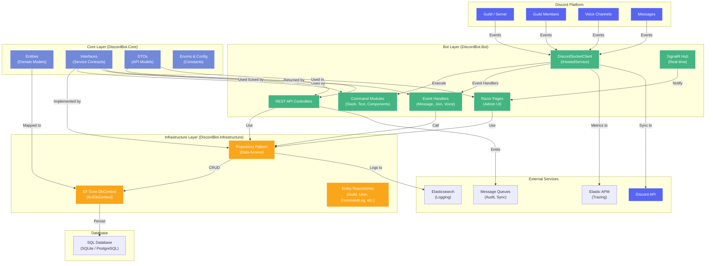

# System Overview

**Version:** 1.0
**Last Updated:** 2026-02-03

## Introduction

This document provides a high-level architectural overview of the Discord Bot Management System. It describes the three-layer clean architecture, key integration points, and how data flows between components. This reference is intended for developers and AI agents (like Claude) who need to understand the system's structure and boundaries.

---

## Architecture Diagram



---

## Layer Architecture

### Overview

The system uses **three-layer clean architecture** to separate concerns:

1. **Core Layer** - Domain logic, interfaces, data contracts
2. **Infrastructure Layer** - Data access, persistence, external integrations
3. **Bot Layer** - Application endpoints, Discord integration, DI composition

This arrangement ensures:
- **Dependency Inversion**: Higher layers depend on abstractions (interfaces) in Core
- **Testability**: Services can be tested with mock implementations
- **Maintainability**: Clear separation of concerns across layers
- **Reusability**: Core and Infrastructure can be used by multiple applications

---

## Core Layer (DiscordBot.Core)

**Location:** `src/DiscordBot.Core/`

### Responsibilities

Contains only abstractions and data types. No external dependencies or implementation details.

### Key Folders

| Folder | Contents | Purpose |
|--------|----------|---------|
| `Entities/` | Domain models (Guild, User, CommandLog, etc.) | Single source of truth for entity definitions |
| `Interfaces/` | Service contracts (IBotService, IGuildService, etc.) | 104+ service interfaces used throughout system |
| `DTOs/` | Data transfer objects (API request/response models) | Decouples API contracts from entities |
| `Enums/` | Constants (AuditLogCategory, ScheduleFrequency, etc.) | Type-safe enumeration of domain values |
| `Configuration/` | Options classes (VerificationOptions, CachingOptions) | IOptions<T> pattern for config binding |
| `Authorization/` | Role definitions and permission constants | RBAC configuration (SuperAdmin, Admin, Moderator, Viewer) |
| `Utilities/` | Helper classes (LogSanitizer, TimezoneHelper) | Shared utilities used across layers |

### Entity Examples

```csharp
// Entity - represents database table
public class Guild
{
    public ulong GuildId { get; set; }
    public string Name { get; set; }
    public bool IsActive { get; set; }
    public DateTime CreatedAt { get; set; }
}

// DTO - API contract
public class GuildDto
{
    public ulong GuildId { get; set; }
    public string Name { get; set; }
}

// Enum - type-safe constants
public enum AuditLogCategory
{
    UserManagement,
    GuildConfiguration,
    CommandExecution,
    // ...
}
```

### Interface Examples

Core defines 104+ service interfaces organized by domain:

- **Bot Control**: IBotService, ICommandRegistrationService
- **Guild Management**: IGuildService, IGuildMemberService
- **User Operations**: IUserManagementService, IUserRepository
- **Logging**: ICommandLogService, IAuditLogService, IMessageLogService
- **Moderation**: IModerationService, ISpamDetectionService, IRaidDetectionService
- **Audio**: ISoundService, ITtsService, IPlaybackService
- **Analytics**: ICommandAnalyticsService, IEngagementAnalyticsService
- **Performance**: IPerformanceAlertService, ILatencyHistoryService, IApiRequestTracker

---

## Infrastructure Layer (DiscordBot.Infrastructure)

**Location:** `src/DiscordBot.Infrastructure/`

### Responsibilities

Implements Core interfaces. Manages data persistence, EF Core mappings, and external data source integrations.

### Key Folders

| Folder | Contents | Purpose |
|--------|----------|---------|
| `Data/BotDbContext.cs` | EF Core DbContext | Single database context for all entities |
| `Data/Configurations/` | Entity configurations | Fluent API mappings (indexes, constraints, conversions) |
| `Data/Repositories/` | Repository implementations | Implements IRepository<T> pattern |
| `Migrations/` | EF Core migrations | Database schema versioning |
| `Services/` | Service implementations | Implements Core interfaces |
| `Tracing/` | OpenTelemetry tracing | Distributed tracing configuration |
| `Data/Interceptors/` | EF Core interceptors | Query performance monitoring |

### Database Context

```csharp
// BotDbContext - single source of truth for database schema
public class BotDbContext : IdentityDbContext<ApplicationUser>
{
    public DbSet<Guild> Guilds { get; set; }
    public DbSet<CommandLog> CommandLogs { get; set; }
    public DbSet<AuditLog> AuditLogs { get; set; }
    public DbSet<ModerationCase> ModerationCases { get; set; }
    // ... 20+ DbSets representing domain entities
}
```

### Repository Pattern

All data access goes through repositories:

```csharp
// Interface (in Core)
public interface IGuildRepository : IRepository<Guild>
{
    Task<Guild?> GetByIdAsync(ulong guildId);
    Task<IEnumerable<Guild>> GetAllActiveAsync();
}

// Implementation (in Infrastructure)
public class GuildRepository : Repository<Guild>, IGuildRepository
{
    public async Task<Guild?> GetByIdAsync(ulong guildId)
    {
        return await _context.Guilds
            .FirstOrDefaultAsync(g => g.GuildId == guildId);
    }
}
```

### Key Entities & Their Purpose

| Entity | Purpose | Size |
|--------|---------|------|
| `CommandLog` | Records every slash command execution | High volume |
| `AuditLog` | Administrative actions (user management, settings changes) | Medium volume |
| `MessageLog` | Opt-in message content logging | Configurable retention |
| `Guild` | Server metadata and configuration | One per guild |
| `GuildMember` | Member snapshots for analytics | High volume snapshot data |
| `ModerationCase` | Moderation actions (kick, ban, warn) | Medium volume |
| `ScheduledMessage` | Recurring/one-time scheduled messages | Configuration |
| `PerformanceIncident` | Database and API performance alerts | Diagnostic |
| `Sound` / `SoundPlayLog` | Soundboard library and usage | Configurable |
| `AssistantInteractionLog` | LLM assistant conversations | Opt-in |

---

## Bot Layer (DiscordBot.Bot)

**Location:** `src/DiscordBot.Bot/`

### Responsibilities

Composes the application. Registers all services (DI), handles Discord events, exposes REST API, and serves web UI.

### Key Folders & Components

#### 1. Discord Bot Integration

| Component | Purpose |
|-----------|---------|
| `BotHostedService.cs` | IHostedService that manages bot lifecycle |
| `Handlers/` | Event handlers for Discord events (messages, joins, roles, voice) |
| `Commands/` | Slash command modules (text commands, interactions) |
| `Preconditions/` | Authorization filters (RequireAdminAttribute, etc.) |

**Event Handler Flow:**
```
Discord Event (e.g., MessageReceived)
   ↓
BotHostedService._client.MessageReceived += handler.HandleAsync
   ↓
Handler executes (e.g., MessageLoggingHandler)
   ↓
Handler calls Repository to persist
   ↓
Handler publishes to SignalR/Kafka for real-time updates
```

#### 2. Web API

| Component | Purpose |
|-----------|---------|
| `Controllers/` | REST API endpoints (ApiController pattern) |
| `Pages/` | Razor Pages for admin UI |
| `Hubs/` | SignalR hubs for real-time dashboard |
| `Authorization/` | Claims transformation and policy handlers |

**API Layers:**
```
Request → Controller → Service → Repository → DbContext → Database
Response ← Controller ← Service ← Repository ← DbContext
```

#### 3. Dependency Injection

Services registered via extension methods in `Extensions/` folder:

```csharp
// In Program.cs
builder.Services.AddDiscordBot(config);        // Discord client, handlers
builder.Services.AddInfrastructure(config);    // DbContext, repositories
builder.Services.AddApplicationServices();     // Core services
builder.Services.AddVoiceSupport(config);      // Audio services
builder.Services.AddModerationServices(config); // Moderation
// ... 10+ feature service registrations
```

**Service Lifetimes:**
- **Singleton**: DiscordSocketClient, VoxClipLibrary, Settings cache
- **Scoped**: Command handlers, HTTP requests, business logic
- **Transient**: Rarely used; for stateless utilities

#### 4. Middleware Pipeline

```
Request
   ↓
ForwardedHeaders (reverse proxy support)
   ↓
CorrelationId (distributed tracing)
   ↓
ApiMetrics (API performance tracking)
   ↓
SerilogRequestLogging (structured request logs)
   ↓
Authentication / Authorization
   ↓
Endpoint (Controller/Razor Page/SignalR)
   ↓
Response
```

---

## Data Flow Examples

### Example 1: User Executes a Slash Command

```
1. User types /soundboard play in Discord
   ↓
2. Discord sends InteractionCreate event to bot
   ↓
3. BotHostedService._client.SlashCommandExecuted fires
   ↓
4. Interaction handler matches command module (SoundboardModule)
   ↓
5. Module method executes:
   - Validates preconditions ([RequireGuildActive], [RequireAudioEnabled])
   - Calls ISoundService.GetSoundAsync()
   - Calls IPlaybackService.PlayAudioAsync()
   - Updates ICommandLogService with execution record
   ↓
6. Services call repository methods:
   - ISoundRepository.GetByNameAsync()
   - ICommandLogRepository.AddAsync()
   ↓
7. Repository executes EF Core query against DbContext
   ↓
8. DbContext persists to SQL database
   ↓
9. Handler publishes audit log to Kafka queue
   ↓
10. Response returned to Discord (deferred, ephemeral, or public)
```

### Example 2: Web Dashboard User Loads Guild Statistics

```
1. User navigates to /admin/guilds/{id}/analytics
   ↓
2. AnalyticsController.GetGuildStats(guildId) executes
   ↓
3. Controller calls:
   - IEngagementAnalyticsService.GetEngagementMetricsAsync()
   - IModerationAnalyticsService.GetCaseCountAsync()
   - IServerAnalyticsService.GetMemberTrendAsync()
   ↓
4. Services construct queries using repositories:
   - IMemberActivityRepository.GetActivitiesBetweenAsync()
   - IModerationCaseRepository.CountByCategoryAsync()
   ↓
5. Repositories execute EF Core queries:
   - DbContext.MemberActivitySnapshots.Where(...).ToListAsync()
   - DbContext.ModerationCases.Where(...).CountAsync()
   ↓
6. Services aggregate results into AnalyticsDto
   ↓
7. Controller returns JSON response
   ↓
8. SignalR DashboardHub pushes real-time update if subscribed
```

### Example 3: Message Logging Handler Processes Event

```
1. Message posted in Discord channel
   ↓
2. DiscordSocketClient.MessageReceived event fires
   ↓
3. MessageLoggingHandler.HandleMessageReceivedAsync() executes
   ↓
4. Handler checks IMessageLogService.IsLoggingEnabledAsync(guildId)
   ↓
5. If enabled:
   - Construct MessageLog entity from IDiscordMessage
   - Call IMessageLogRepository.AddAsync(messageLog)
   - Enqueue audit entry to IAuditLogQueue
   ↓
6. Repository persists to database via DbContext
   ↓
7. Concurrent handlers may process same event:
   - ActivityEventTrackingHandler (analytics)
   - AutoModerationHandler (content filter)
   - AssistantMessageHandler (LLM mentions)
   ↓
8. Each handler updates their respective tables independently
```

---

## Key Integration Points

### Discord Platform

The bot connects to Discord via `DiscordSocketClient`:

- **Connection**: WebSocket gateway for real-time events
- **Commands**: Slash commands, text commands, button/select interactions
- **Events**: MessageReceived, UserJoined, ReactionAdded, VoiceStateUpdated, etc.
- **OAuth**: Discord OAuth2 for web portal authentication

### Database

Single `BotDbContext` using Entity Framework Core:

- **Provider**: SQLite (dev), PostgreSQL (production)
- **Migrations**: EF Core Code First migrations in `Migrations/` folder
- **Lifetime**: Scoped to HTTP requests; singleton for background services
- **Queries**: LINQ-based via repositories

### Message Queues (Kafka)

Asynchronous event publishing:

- `IAuditLogQueue`: Enqueues audit log entries for async processing
- `IMemberSyncQueue`: Enqueues member data sync tasks
- Enables decoupling of event processing from storage

### Observability

#### Serilog Logging
```csharp
_logger.LogInformation("Guild {GuildId} created", guildId);
```
Logs enriched with correlation ID, service version, machine name.

#### OpenTelemetry Tracing
```csharp
using var activity = BotActivitySource.StartActivity("slash-command");
```
Traces distributed across handlers and service calls.

#### Elasticsearch
All logs shipped to Elasticsearch for long-term storage and search.

#### Elastic APM
Captures performance metrics, error rates, and service dependencies.

### SignalR Real-Time Updates

Dashboard subscribes to updates via `DashboardHub`:

```csharp
// Server broadcasts to connected clients
await _hubContext.Clients.All.SendAsync("OnBotStatusUpdated", status);

// Client JavaScript receives update
hubConnection.on("OnBotStatusUpdated", (status) => {
    updateDashboard(status);
});
```

---

## Service Registration Pattern

All services follow the extension method pattern for clean DI composition:

```csharp
// In Bot/Extensions/ApplicationServiceExtensions.cs
public static class ApplicationServiceExtensions
{
    public static IServiceCollection AddApplicationServices(
        this IServiceCollection services)
    {
        services.AddScoped<IBotService, BotService>();
        services.AddScoped<IGuildService, GuildService>();
        services.AddScoped<IUserManagementService, UserManagementService>();
        // ... more services
        return services;
    }
}

// In Bot/Extensions/AuditLoggingExtensions.cs
public static class AuditLoggingExtensions
{
    public static IServiceCollection AddAuditLogging(
        this IServiceCollection services,
        IConfiguration config)
    {
        services.Configure<AuditLogRetentionOptions>(
            config.GetSection("AuditLog"));
        services.AddScoped<IAuditLogService, AuditLogService>();
        // ... more audit services
        return services;
    }
}
```

**Benefits:**
- Feature services grouped logically
- Conditional registration based on configuration
- Easy to enable/disable features
- Testable via mock registrations

---

## Boundary Definitions

### Core ↔ Infrastructure

**What flows out of Core:**
- Interfaces (`IRepository<T>`, `IService<T>`)
- DTOs (API contracts)
- Enums (domain constants)
- Configuration classes

**What Infrastructure implements:**
- Repositories that query DbContext
- Services that call repositories
- DbContext mappings and migrations

### Infrastructure ↔ Bot

**What flows out of Infrastructure:**
- Implementations of Core interfaces
- Database connection management
- Migration scripts

**What Bot provides:**
- DI registration via extension methods
- HTTP request scope lifetime management
- Discord event wiring

### Bot ↔ External Services

**Outbound:**
- Discord events → REST API responses
- Database queries → SQL statements
- Logs → Elasticsearch
- Traces → Elastic APM
- Events → Kafka queues

**Inbound:**
- Discord WebSocket events
- HTTP requests
- Configuration from environment

---

## Configuration Management

The system uses the `IOptions<T>` pattern for all configuration:

```csharp
// In Core/Configuration/
public class BotConfiguration
{
    public string Token { get; set; }
    public ulong? TestGuildId { get; set; }
}

// In appsettings.json
{
  "Bot": {
    "Token": "...",
    "TestGuildId": 123456789
  }
}

// In Program.cs
builder.Services.Configure<BotConfiguration>(
    builder.Configuration.GetSection("Bot"));

// In services
public class BotService
{
    public BotService(IOptions<BotConfiguration> options)
    {
        _config = options.Value;
    }
}
```

**Sensitive values** use ASP.NET Core User Secrets for local development.

---

## Key Design Patterns

| Pattern | Usage | Example |
|---------|-------|---------|
| **Repository** | Data access abstraction | `IGuildRepository.GetByIdAsync()` |
| **Dependency Injection** | Service composition | Extension methods in Program.cs |
| **IOptions<T>** | Configuration binding | `IOptions<BotConfiguration>` |
| **Background Service** | Long-running tasks | `ScheduledMessageService : BackgroundService` |
| **Hosted Service** | Lifecycle management | `BotHostedService : IHostedService` |
| **SignalR Hub** | Real-time notifications | `DashboardHub : Hub` |
| **Middleware** | Request pipeline | `CorrelationIdMiddleware` |
| **Precondition Filters** | Authorization | `[RequireAdminAttribute]` |
| **Event Handler** | Async processing | `MessageLoggingHandler` |
| **Mapper Pattern** | DTO conversion | Entity → DTO transformation |

---

## Scalability Considerations

### Horizontal Scaling

The current architecture supports horizontal scaling with:
- **Stateless services**: Services don't hold state between requests
- **Distributed tracing**: Correlation IDs link requests across instances
- **Message queues**: Kafka enables async processing without state sharing
- **Database pooling**: Connection pooling for concurrent requests

### Caching Strategy

- **Singleton caches**: VoxClipLibrary, settings cache (rarely updated)
- **Distributed tracing**: OpenTelemetry for observability
- **Instrumented cache**: IInstrumentedCache for metrics

### Performance Optimization

- **Query performance monitoring**: EF Core interceptors log slow queries
- **Database indexes**: Configured in entity configurations
- **Pagination**: Controllers paginate large result sets
- **Lazy loading**: DTO projections avoid unnecessary navigation

---

## Testing Architecture

Tests can mock Core interfaces at three levels:

1. **Unit Tests**: Mock repositories, test services in isolation
2. **Integration Tests**: Use test DbContext, test service composition
3. **End-to-End Tests**: Test full request flow including Discord events

Example:
```csharp
// Unit test with mocked repository
var mockGuildRepo = new Mock<IGuildRepository>();
mockGuildRepo.Setup(r => r.GetByIdAsync(guildId))
    .ReturnsAsync(testGuild);

var service = new GuildService(mockGuildRepo.Object);
var result = await service.GetGuildAsync(guildId);

Assert.Equal(testGuild.Name, result.Name);
```

---

## Deployment Architecture

```
┌─────────────────┐
│  Load Balancer  │
│   (Reverse      │
│    Proxy)       │
└────────┬────────┘
         │
    ┌────┴────┐
    │          │
┌───▼──┐   ┌──▼───┐
│Bot 1 │   │Bot 2 │  (Multiple instances)
│ Inst │   │ Inst │
└───┬──┘   └──┬───┘
    │          │
    └────┬─────┘
         │
    ┌────▼─────────┐
    │ Shared       │
    │ Database     │
    │ (PostgreSQL) │
    └──────────────┘
         │
    ┌────▼─────────┐
    │ Message      │
    │ Queue        │
    │ (Kafka)      │
    └──────────────┘
         │
    ┌────▼──────────────┐
    │ Observability     │
    │ Stack:            │
    │ - Elasticsearch   │
    │ - Elastic APM     │
    │ - Kibana          │
    └───────────────────┘
```

---

## Common Development Tasks

### Adding a New Feature Service

1. **Define interface in Core**: `INewFeatureService`
2. **Implement in Infrastructure/Bot**: `NewFeatureService`
3. **Create repository if data access needed**: `INewEntityRepository`
4. **Register in DI extension**: `AddNewFeature()`
5. **Inject into controllers/handlers**: Constructor injection
6. **Update documentation**: Add to service-architecture.md

### Adding a New Entity

1. **Create entity in Core/Entities**: `NewEntity.cs`
2. **Create repository interface in Core/Interfaces**: `INewEntityRepository`
3. **Create repository in Infrastructure**: `NewEntityRepository`
4. **Create EF configuration**: `NewEntityConfiguration`
5. **Create DbSet in BotDbContext**: `public DbSet<NewEntity> NewEntities`
6. **Create migration**: `dotnet ef migrations add AddNewEntity`

### Adding a New API Endpoint

1. **Create controller in Bot/Controllers**: `NewFeatureController`
2. **Inject required services**
3. **Create request/response DTOs in Core/DTOs**
4. **Implement GET/POST/PUT/DELETE methods**
5. **Add [Authorize] and policy attributes**
6. **Update Swagger documentation**: XML comments
7. **Test with Swagger UI**: `https://localhost:5001/swagger`

---

## Related Documentation

For deeper dives into specific areas, see:

- [Service Architecture](service-architecture.md) - Comprehensive service catalog
- [Database Schema](articles/database-schema.md) - Entity relationships
- [Authorization Policies](articles/authorization-policies.md) - RBAC system
- [API Endpoints](articles/api-endpoints.md) - REST API reference
- [Interactive Components](articles/interactive-components.md) - Discord interactions

---

## Conclusion

The three-layer architecture provides clear separation of concerns and enables the system to grow without coupling layers. Services communicate through well-defined interfaces, making the codebase testable, maintainable, and extensible. Understanding these layer boundaries is essential for effective development and architectural decision-making.
